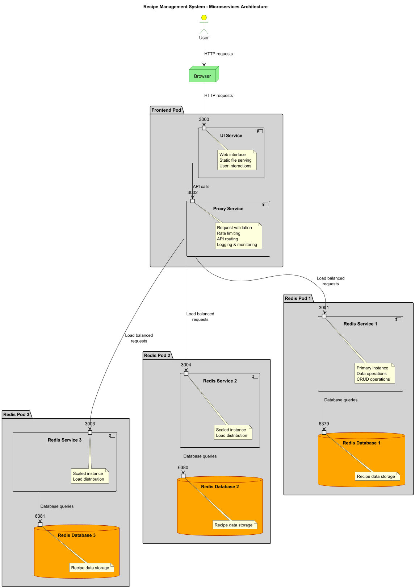

# Recipe Management System - Microservices Architecture

This project has been split into multiple Node.js services organized in a pod-based architecture for better scalability and maintainability:

## Architecture Overview

### Frontend Pod (frontend-pod/)
The UI and Proxy services are deployed together as a cohesive frontend pod:

#### 1. UI Service (frontend-pod/ui-service/)
- Serves the web interface
- Proxies API calls to the Proxy service
- Handles static file serving
- Runs on port 3000

#### 2. Proxy Service (frontend-pod/proxy-service/)
- Acts as intelligent middleware layer
- Provides request validation and rate limiting
- Enhances logging and monitoring
- Routes requests to appropriate Redis services
- Runs on port 3002

### Backend Service

#### 3. Redis Service (redis-service/)
- Handles data storage and retrieval operations
- Manages Redis database connections
- Provides RESTful API for recipe data
- Runs on port 3001 (and 3003, 3004 for distributed scaling)

## Quick Start

### Option 1: Using the Frontend Pod (Recommended)

1. **Start Redis Service**:
   ```powershell
   cd redis-service
   npm install
   npm start
   ```

2. **Start the Frontend Pod**:
   ```powershell
   cd frontend-pod
   .\start-pod.ps1    # For PowerShell
   # or
   .\start-pod.bat    # For Command Prompt
   ```

3. **Access the application**:
   - Web Interface: http://localhost:3000
   - Proxy Service: http://localhost:3002
   - Redis Service API: http://localhost:3001

### Option 2: Manual Service Startup

1. **Start Redis** (if not already running):
   ```powershell
   # Using Docker
   docker run -d -p 6379:6379 redis:alpine

   # Or install locally and start
   redis-server
   ```

2. **Start Redis Service**:
   ```powershell
   cd redis-service
   npm install
   npm start
   ```

3. **Start Frontend Pod Services** (in new terminals):
   ```powershell
   cd frontend-pod/proxy-service
   npm install
   npm start
   
   # In another terminal
   cd frontend-pod/ui-service
   npm install
   npm start
   ```

## Architecture Design

### Complete System Architecture



*Component diagram showing all services, pods, and their relationships with load balancing across multiple Redis instances.*

### API Request Flow


*Sequence diagram showing how API requests are processed through the system with load balancing across multiple Redis services.*

### System Flow

```
[Browser] 
    ↓ (HTTP requests)
[Frontend Pod]
    ├── UI Service (Port 3000) - Web interface & static files
    └── Proxy Service (Port 3002) - Request validation & routing
              ↓ (Load balanced API calls)
[Redis Pod 1] (Port 3001) ─┐
[Redis Pod 2] (Port 3004) ─┼─ Data operations & storage
[Redis Pod 3] (Port 3003) ─┘
```

### Component Responsibilities

**Frontend Pod** (Co-located services)
- **UI Service**: Serves the web application and handles user interactions
- **Proxy Service**: Validates requests, enforces rate limits, and routes API calls

**Redis Pods** (Distributed for scaling)
- **Redis Pod 1** (Port 3001): Primary data operations and Redis database (Port 6379)
- **Redis Pod 2** (Port 3004): Load-balanced data operations and Redis database (Port 6380)
- **Redis Pod 3** (Port 3003): Load-balanced data operations and Redis database (Port 6381)

### Request Flow

1. **User Interaction**: Browser sends HTTP requests to UI Service (port 3000)
2. **API Routing**: UI Service forwards API calls to Proxy Service (port 3002)  
3. **Request Processing**: Proxy Service validates and load balances across Redis Services (ports 3001, 3003, 3004)
4. **Data Operations**: Selected Redis Service performs CRUD operations on its Redis Database
5. **Response Chain**: Results flow back through the same path to the user

## API Endpoints

All services expose recipe management endpoints:

- POST /recipe/:name - Add ingredients to a recipe
- GET /recipe/:name - Retrieve recipe ingredients
- GET /health - Service health check
- GET /metrics - Service metrics (Proxy service only)

## Development

Each service can be developed and deployed independently:

- **Redis Service**: Focus on data operations and Redis integration
- **Frontend Pod**: UI and proxy logic deployed together for consistency

## Environment Configuration

**redis-service/.env**:
```env
REDIS_URL=redis://localhost:6379
PORT=3001
```

**frontend-pod/ui-service/.env**:
```env
PORT=3000
PROXY_SERVICE_URL=http://localhost:3002
```

**frontend-pod/proxy-service/.env**:
```env
PORT=3002
REDIS_SERVICE_BASE_URL=http://localhost
```

## Benefits of This Architecture

1. **Pod-based Organization**: Related services (UI + Proxy) are grouped together
2. **Separation of Concerns**: Frontend pod handles user-facing logic, Redis service handles data
3. **Scalability**: Each service can be scaled independently
4. **Maintainability**: Clear service boundaries with related components co-located
5. **Fault Isolation**: Issues in one service don't directly affect others
6. **Deployment Consistency**: Frontend pod ensures UI and Proxy services are always deployed together

## Migration History

This project evolved from:
1. **Original**: Single monolithic Node.js application
2. **Phase 1**: Split into separate UI, Proxy, and Redis services
3. **Phase 2**: Reorganized into pod-based architecture reflecting deployment reality

The API contract remains the same, so existing clients continue to work without changes.
